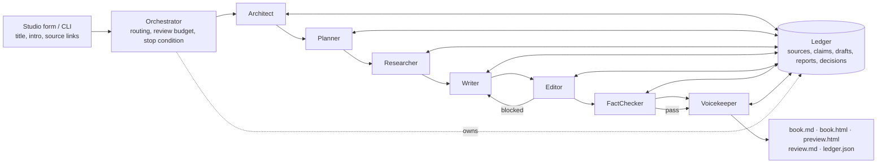
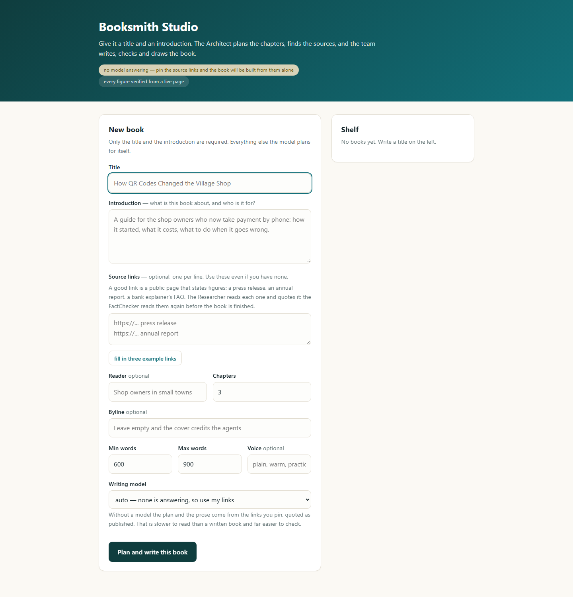
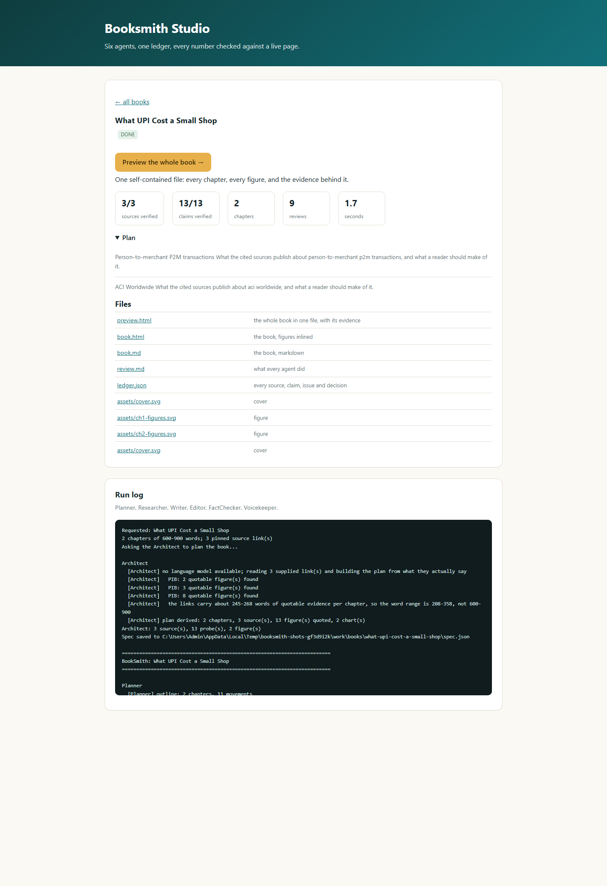
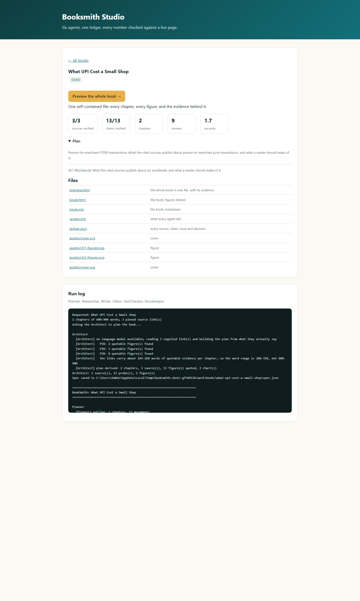
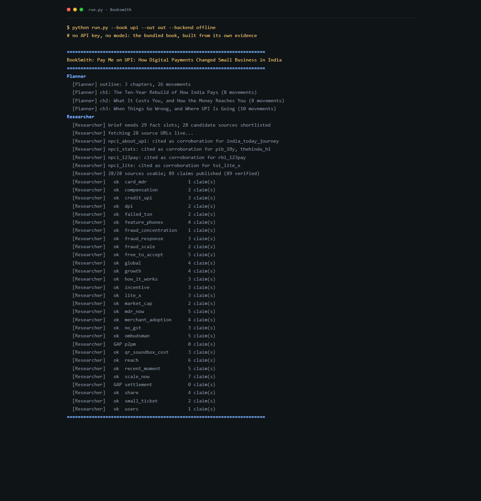
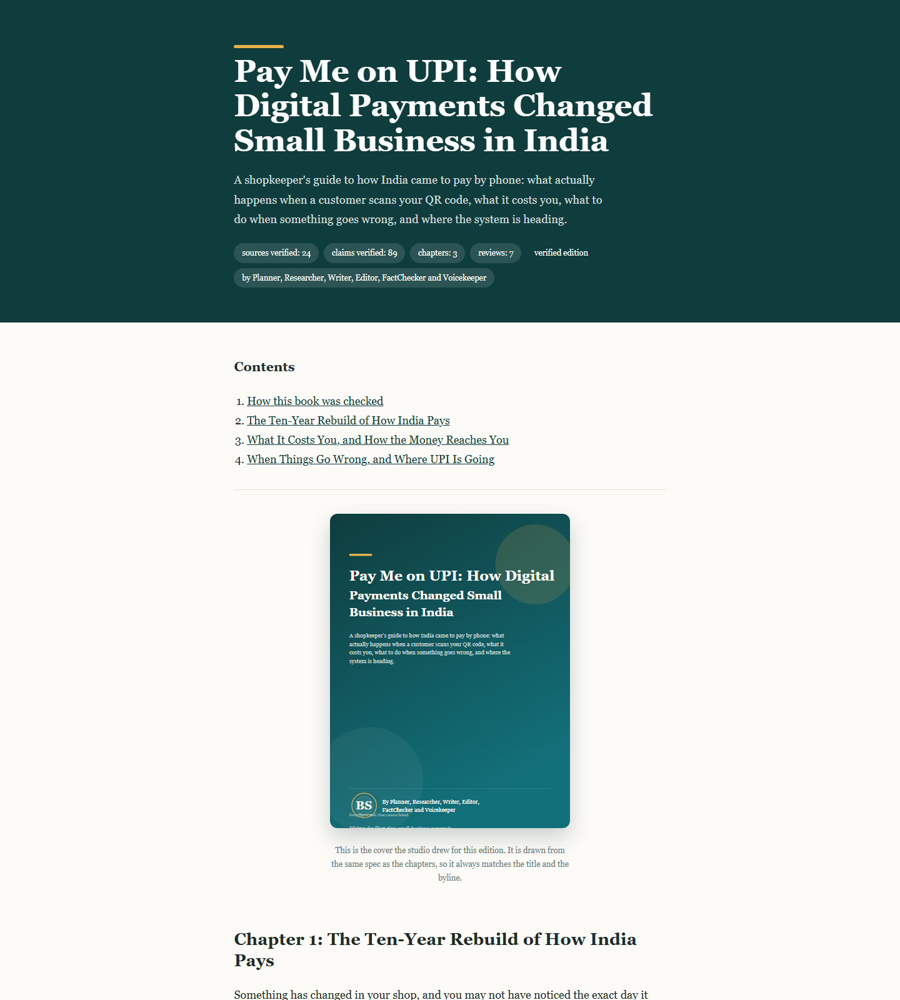
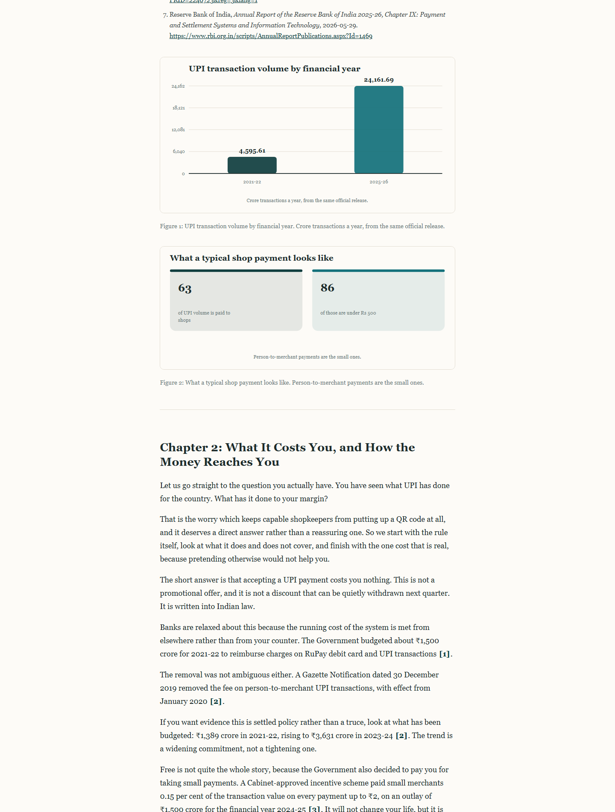
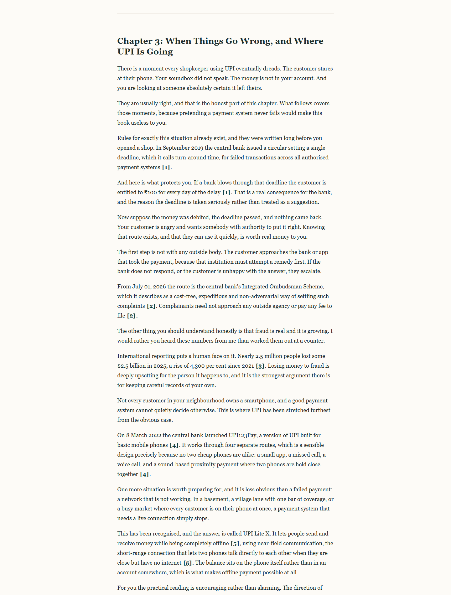

# Booksmith

A team of agents that writes a short, fully cited book - and a studio page where
you ask for one by giving it nothing but a title and an introduction.

```
python studio.py          # http://127.0.0.1:8765/  - type a title, get a book
python run.py             # make the bundled book from the command line
python selftest.py        # prove the whole thing works, with no API key
```

Python 3.11 or newer. No `pip install`, no dependencies: the whole thing is the
standard library, including the HTTP server and the chart drawing.

**Read what it produced:** [`docs/sample-book/preview.html`](docs/sample-book/preview.html)
- the whole book in one file, cover, chapters, figures and the evidence behind
every sentence.

## How it works



Agents never call each other. Each one reads the shared ledger, writes its own
artefacts into it, and returns a decision. The Orchestrator owns the routing, the
review budget and the stop condition, which is the only place collaboration is
decided.

The same diagram, drawn as one self-contained page you can open or screenshot:
[`docs/architecture.html`](docs/architecture.html). It is generated by
`python tools/architecture.py`, which refuses to draw an agent that is not a real
module in `booksmith/agents/` - so the picture cannot quietly drift away from the
code.

---

## The studio

Open `studio.py` and you get one form: a **title** and an **introduction**.
Everything else - the chapter plan, the sources, the evidence, the glossary, the
charts - is written for you. Add source links if you already know which pages
carry your figures; the planner is told to use them. With no links of your own,
press **fill in three example links** under the links box: it pastes three public
pages so you can see a finished book before finding your own sources.

If there is nothing to plan from - no links and no model answering - the form says
so there and then, and asks for a link, rather than starting a run that cannot
finish.

Press the button and a run starts in the background. The page streams the log
while it happens, and when it finishes you get:

| File | What it is |
|---|---|
| `output/preview.html` | **one file to read and to share**: cover, every chapter, every figure inlined, and the evidence behind it |
| `output/book.html` | the book alone, one self-contained file |
| `output/book.md` | the book as markdown |
| `output/review.md` | every agent, every issue, every decision |
| `output/ledger.json` | every source, claim, figure and review |
| `output/assets/*.svg` | the cover and one chart per figure |
| `spec.json` | the plan, so the same book can be rebuilt or edited |
| `studio.log` | the transcript of the run |

Books live in `books/<slug>/`, so the shelf keeps every book you have made.

### What needs a model

Planning a *new* book needs a language model **unless you pin source links**. With
links and no model, the Architect reads the pages you pinned, finds the sentences
worth quoting, and builds the plan out of those figures; the Writer then quotes them
with their citations. What you get is a documented digest of those pages rather than
a written book - shorter, plainer, and checkable line by line - but it is a real
book, finished and reviewed, in seconds.

To choose that on purpose, set **Writing model** to *none — build only from my
links*. Leave it on *auto* and a model is used whenever one answers.

With *auto*, a model is found if any of these is present:

**Ollama - free and local (nothing leaves your machine)**

```
winget install Ollama.Ollama      # or download from ollama.com
ollama pull qwen2.5:7b            # or llama3.1, mistral, gemma2, deepseek-r1
python studio.py                  # ollama is found automatically
```

Start the server with a bigger context window the first time, because the
Architect's prompt is long and Ollama defaults to 4096 tokens:

```
$env:OLLAMA_CONTEXT_LENGTH="16384"
ollama serve
```

Choose a different model with `python studio.py --model llama3.1` or
`python run.py --backend ollama --model qwen2.5:7b`. If Ollama is not running,
the studio says so on the front page instead of failing on the first chapter.

**A paid key, if you would rather**

```
set ANTHROPIC_API_KEY=sk-...      # or OPENAI_API_KEY, or GEMINI_API_KEY
python studio.py
```

Keys are preferred over Ollama when both are available. A backend that stops
answering is set aside for ten minutes rather than retried by every agent, so a
run that cannot use a model says so in one line instead of going quiet for minutes
at a time. Without any model at all, the studio still runs and the bundled book
(`python run.py`) still produces a full book offline, because its plan and its
prose are authored.

### The no-model book, honestly described

Pick *none* and pin links, and every sentence of the book is a sentence a source
published, quoted with the reference beside it:

| | With a model | Links only |
|---|---|---|
| Chapter plan | written for the topic | built from the figures the pages contain |
| Prose | written, then checked | quoted, then checked |
| Length | 600–900 words per chapter | whatever the evidence carries, and the range says so |
| Tone | the book's voice | the sources' wording, so it reads like press releases |

The review gate does not soften any of this. A press-release word in a quoted
sentence is still reported as a tone issue in `review.md`; it is not quietly
rewritten, because rewriting it without a model is how a figure gets misquoted.

---

## The team

Six agents, one shared ledger, one orchestrator. Agents never call each other:
they read the ledger, write their own artefacts into it, and return a decision.
The orchestrator owns every collaboration rule, which is what makes the whole run
explainable in one sitting.

| Agent | What it does | What it may not do |
|---|---|---|
| **Architect** | turns a title and an introduction into a plan: outline, sources, probes, glossary, figures - or reads the pinned links and builds the plan from what they actually say | invent a figure; every source must be a real https page |
| **Planner** | turns the plan into chapters and movements, each naming the evidence slots it needs | name a source |
| **Researcher** | fetches every candidate URL and runs each probe against the live text | publish a claim whose probe did not match |
| **Writer** | writes each chapter from verified claim cards only | add a figure, date or name that is not on a card |
| **Editor** | brief compliance, grammar, tone, readability | change a number |
| **FactChecker** | re-fetches every cited page, re-runs its probe, audits every numeral | pass a chapter it cannot confirm |
| **Voicekeeper** | cross-chapter consistency | rewrite a chapter that already passed both reviews |

The FactChecker is a gate, not a reporter. A chapter that still has a blocking
issue after its round budget is **withheld**, not shipped with a warning.

```
Architect -> Planner -> Researcher -> for each chapter:
    Writer -> Editor -> FactChecker -> revise, up to 3 rounds -> withhold if still dirty
    -> Voicekeeper -> Assembler
```

### The rule everything rests on

A number can only enter the prose by travelling from a page, through a regex, into
a claim, into a sentence that carries that claim's citation:

```python
P("daily_volume",
  "On average 66 crore UPI transactions happen every single day.",
  r"Daily Average Transactions \(2025\)\s*(?P<daily_crore>[\d,]+)\s*Crore"),
```

`daily_crore` is the only channel to that figure. If the page stops matching, the
claim never exists, the sentence is never written, and the chart that would have
plotted it is not drawn. The FactChecker repeats the whole journey after the
chapter is written, so a figure cannot drift away from its source either.

Bot-protected publishers (`npci.org.in` answers 403 to scripts but serves readers
fine) are handled honestly: the link is kept only when another, machine-verifiable
source carries the same figure, and the book says which.

### What a reference list has to be

The spec sets the rules (`reference_rules`), and the FactChecker enforces them:
each chapter ends with its own numbered list, running 1, 2, 3 in order of first
appearance, and every entry gives **source organisation, title, date and a working
link**. Numbering is per *source page*, so a page that carries three figures is
listed once and cited three times - the FactChecker still re-reads that page once
per figure, so sharing a number hides nothing.

---

## The command line

```
python run.py --list-books
python run.py --out output/trial
python run.py --no-live                 # air-gapped: the gate still refuses to publish
python run.py --spec books/my-book/spec.json --backend ollama --model qwen2.5:7b
python run.py --title "Pay Me on UPI" --intro "How digital payments changed small
    business in India." --urls https://... --backend offline --out output/upi
python run.py --title "..." --intro "..." --author "Meera Raghavan" --urls https://...
python studio.py --port 9000 --no-browser --rounds 4
```

`--title` plans a new book the same way the studio form does, and writes the plan
to `spec.json` in the output directory, so the run can be repeated or edited
without planning it twice.

`--author`, or the studio's **Byline** box, names the author shown on the cover
and under the title. Left empty, the cover credits the agents that wrote it -
there is no invented portrait, just the studio's seal and the byline.

## Checking it works

```
python selftest.py
```

Four passes, no API key needed: the bundled spec is valid, the studio's routes
answer (index page, form, redirect, status API, file server), the whole AI path
runs to a finished book, and the Ollama backend speaks the right protocol. The
last two substitute a *stub* for the text model and nothing else - the researcher
still fetches real pages, the probes still have to match, and the fact-checker
still withholds a chapter that fails.

## The studio, running

Every shot below is real output, captured by `python tools/screenshots.py`, which
starts the studio on a free port with `--backend offline`, posts the form, waits
for the run, photographs it with headless Edge and cuts the book page into pieces
using its own PNG decoder. `python tools/check_shots.py` then checks each file is
a real page rather than a blank frame.

| | |
|---|---|
|  |  |
| The studio: one form, title and introduction | A run caught working: the live log |
|  |  |
| The finished run: plan, stats, files, log | The same book from `run.py`, no API key |
|  |  |
| The book: drawn cover, byline, contents | A chapter with its chart, every figure cited |
|  | |
| The evidence section: reviews and claims | |

## Layout

```
studio.py                 start the studio
run.py                    run a book from the command line
selftest.py               prove the three paths without an API key
booksmith/
  spec.py                 a book as data: brief, outline, sources, probes, figures
  orchestrator.py         every collaboration rule
  ledger.py               the shared blackboard
  models.py               the typed artefacts agents exchange
  http.py                 fetching and reading public pages (stdlib)
  llm.py                  pluggable model backends + an offline fallback
  validators.py           brief compliance, as readable regex rules
  visuals.py              SVG cover and charts, drawn from verified values
  render.py               book.md, book.html, review.md
  agents/                 architect, planner, researcher, writer, editor,
                          fact_checker, voicekeeper
  knowledge/              the bundled UPI book: brief, outline, sources, prose
  knowledge/probes.py     finding the quotable sentences in a page you pinned
  studio/                 the index page and its server
tools/
  architecture.py         draw the architecture diagram, checked against the code
  screenshots.py          capture the screenshots above with headless Edge
  check_shots.py          prove a screenshot is a page and not a blank frame
  pngslice.py             a small PNG reader/writer, used to cut the book page
  probe_model.py          which model `auto` picked, and will it answer in JSON
docs/
  architecture.html       the diagram as one self-contained page
  screenshots/            the seven shots
  sample-book/            the finished book: preview.html, book.md, review.md
```

A book is a `BookSpec`: one JSON document holding the brief, the outline, the
candidate sources with their probes, the glossary and the figures. Adding a book
means adding a spec, not editing the pipeline.

## Requirements

Python 3.11+. A model - Ollama locally or a paid key - only if you want new books
written for you rather than assembled from links you pinned. Network access only if
you want figures verified: `--no-live` shows what happens without it, which is that
nothing verifies and so nothing is published.

There are no dependencies to install. `requirements.txt` exists only to say so,
for anyone who looks. The two scripts in `tools/` need Edge or Chrome on the path,
and nothing else.